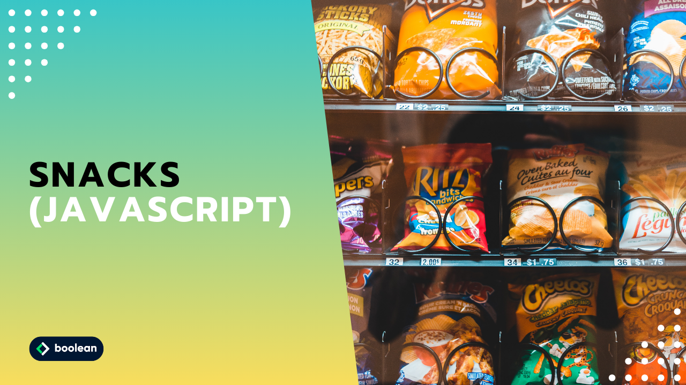

 
Ventitreesimo Esercizio Classe #137 - Boolean

---

Studente: Fabio Ferrero

---
# English

## Target of the project:
Solve the attached snacks by defining and invoking functions.

<strong>BONUS</strong>
- Solve the snacks using both traditional and arrow functions.
- Solve the fourth snack in the `05 - bonus` folder.

---
# Italiano

## Obiettivo del progetto:
Risolvi gli snack che troverai in allegato definendo e invocando delle funzioni.

<strong>BONUS</strong>
- Risolvere gli snack usando sia le funzioni tradizionali che le arrow functions.
- Risolvere il quarto snack nella cartellina `05 - bonus`

---

